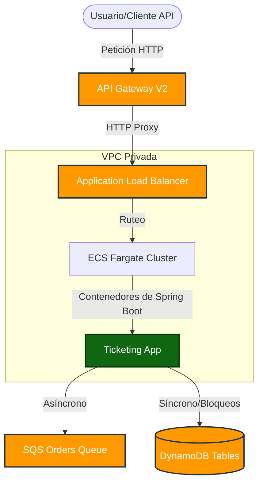

# Infraestructura como Código (IaC) - Ticketing API

Este proyecto contiene la definición de infraestructura de la plataforma reactiva de ticketing, completamente abstraída en **Terraform**.

## Arquitectura Cloud-Native (AWS)
La solución está enfocada en componentes "Serverless" y administrados bajo los principios de *Elasticidad y Alta Disponibilidad*.

### 📊 Diagrama de Arquitectura



### 🎯 Decisiones Arquitectónicas (ADR)

1. **ECS Fargate (Compute)**: Se eligió Fargate en lugar de EC2 tradicionales o EKS (Kubernetes) porque simplifica la administración operativa. No hay servidores que parchear ni escalar manualmente; Fargate provisiona exactamente los recursos de CPU/RAM necesarios por cada tarea de Spring Boot, reduciendo la superficie de ataque y ajustando el costo a la ejecución.
2. **API Gateway V2 + ALB (Networking/Proxy)**: El servicio Spring Boot se expone a través de un Load Balancer dentro de la red privada (VPC). API Gateway actúa como proxy público. **¿Por qué dos capas?** API Gateway nos permite incorporar fácilmente "Throttling" (límites de peticiones) futuros, validaciones de tokens JWT nativas y unificado de APIs sin tocar el código Java. El ALB se encarga del balanceo distribuido hacia los contenedores.
3. **DynamoDB (Base de datos)**: Elegida por encima de RDS para persistencia por su modo *On-Demand* y su integración natural con sistemas altamente concurrentes sin necesidad de administrar *connection pools* (problema típico en bases relacionales bajo gran carga). Además, soporta Transacciones (ACID) perfectas para la reserva de tickets (Optimistic Locking).
4. **SQS (Mensajería)**: Sistema de colas Standard utilizado para procesar y "aplanar" la de curva de procesamiento de pagos/notificaciones de pedidos. Frente a ráfagas de compra, SQS absorberá los eventos para que la aplicación no colapse y los vaya procesando a su propio ritmo.
5. **CI/CD Pipeline (GitHub Actions)**: Se decidió separar el ciclo de infraestructura (*IaC*) del código aplicativo. Utilizando un State backend `s3` y bloqueos con `dynamodb_table`, los despliegues con Terraform se automatizan de manera inmutable y segura cada vez que se hace un *Push* o *Pull Request* al repositorio.

### 🏗️ Desglose de Módulos Terraform

1. **Networking (`modules/networking`)**: Crea una Virtual Private Cloud (VPC) con subredes públicas (para el ALB / IGW) y privadas (donde residen los contenedores de la aplicación) en dos Zonas de Disponibilidad distintas.
2. **Compute (`modules/compute`)**: Define la ejecución inmutable utilizando contenedores en ECS Fargate con ECR para almacenar las imágenes.
3. **Database (`modules/dynamodb`)**: Provisiona DynamoDB (Eventos y Tickets).
4. **Messaging (`modules/sqs`)**: Crea la cola asíncrona de pedidos.
5. **API Gateway (`modules/apigateway`)**: Actúa como un proxy de entrada expuesto que dirige tráfico al ALB interno.

---

## 🛠️ Cómo Iniciar

### 1. Inicializar los Módulos
Sitúate en esta carpeta (`/iac`) que contiene el archivo `main.tf` y ejecuta:
```bash
terraform init
```

### 2. Validar o Formatear
```bash
terraform validate
terraform fmt -recursive
```

### 3. Plan de Ejecución
Para visualizar qué creará Terraform en tu cuenta AWS:
```bash
terraform plan
```

### 4. Desplegar
Confirma la creación de los componentes en tu cuenta. Presta especial atención al valor de la variable `environment` y al exporte (outputs) una vez termine.
```bash
terraform apply
```

---

## 🚀 Flujo de Despliegue de la Aplicación (El paso a paso a Producción)

Una vez que `terraform apply` finaliza:

1. **Observa el output `ecr_repository`**, allí deberás _pushear_ la imagen Docker de Spring Boot compilada.
2. **Inicia sesión de Docker en ECR:**
   ```bash
   aws ecr get-login-password --region us-east-1 | docker login --username AWS --password-stdin <tu_account_id>.dkr.ecr.us-east-1.amazonaws.com
   ```
3. **Sube la imagen etiquetada:**
   ```bash
   docker tag ticketing-app:latest <ecr_repository_url>:latest
   docker push <ecr_repository_url>:latest
   ```
4. Fargate comenzará a desplegar tu Task, pasará tu Health check en `/actuator/health` y el servicio completo se expondrá de manera segura en el `api_endpoint` entregado en los Terraform Outputs.
